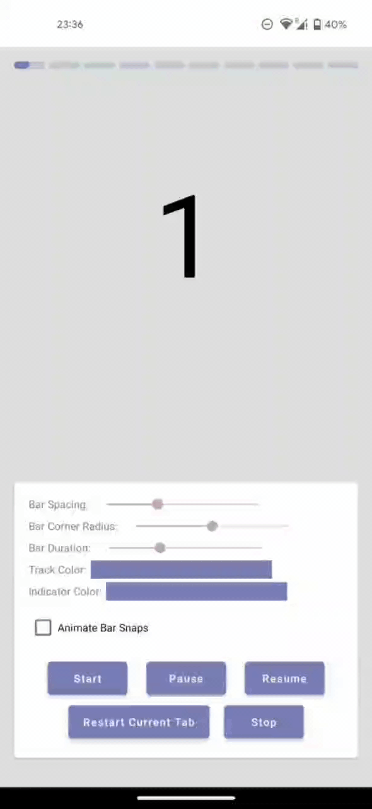

# Story Tab Layout

[](https://github.com/efguydan/StoryTabLayout/actions/workflows/android.yml)
[](https://search.maven.org/search?q=g:%22io.github.efguydan%22%20AND%20a:%22StoryTabLayout%22)

A library that provides a Story-like Tab Layout for your ViewPager and other usecases

## Preview



## Gradle Dependency

StoryTabLayout is hosted on MavenCentral. To add to your project, include `mavenCentral()` to your repositories and then add the dependency to your module’s build.gradle.

```groovy
implementation 'io.github.efguydan:StoryTabLayout:<insert-version-here>'
```

For versions, check [here](https://github.com/efguydan/StoryTabLayout/releases) for the releases.

## Usage

Add `StoryTabLayout` to your layout file.

```xml
<com.efedaniel.storytablayout.StoryTabLayout
  android:id="@+id/storyTabLayout"
  android:layout_width="match_parent"
  android:layout_height="wrap_content" />
```

Then you need to setup the Story Tab Layout with a `ViewPager`, `ViewPager2`, or with a custom number of Tabs. 

```kotlin
fun setupStoryTabLayout() {
  // Set up with a ViewPager
  storyTabLayout.setupWithViewPager(viewPager)

  // Set up with a ViewPager2
  storyTabLayout.setupWithViewPager2(viewPager2)

  // Set up with Number of Tabs
  storyTabLayout.setupWithNumberOfTabs(numberOfTabs = 10, initialPage = 5)
}
```

>If you are setting up with a ViewPager / ViewPager2, you should make sure your adapter is setup before calling the setup method.
>
>If you are setting up with Number of Tabs, the initial Page argument is optional and has a default value of 0.

After that, you just need to call the start method and voila!

```kotlin
fun setupStoryTabLayout() {
  // Start the Story Tab Layout
  storyTabLayout.start()
}
```

## Customization

| Property | XML | Programmaticaly | Default Value |
| --- | --- | --- | --- |
| Spacing between Bars | app:barSpacing | barSpacing | 4dp |
| Bar Corner Radius | app:barCornerRadius | barCornerRadius | 4dp |
| Bar Duration | app:barDurationInMs | barDurationInMs | 5000 ms |
| Bar Track Color | app:barTrackColor | barTrackColor | Primary Color |
| Bar Indicator Color | app:barIndicatorColor | barIndicatorColor | Primary Color (Disabled Alpha) |
| Animate Bar Snaps | app:animateBarSnaps | animateBarSnaps | false |

## Functionality

- `start()` - Starts the Story Tab Layout
- `pause()` - Pauses the Current Bar of the Story Tab Layout
- `resume()` - Resumes the Current Bar of the Story Tab Layout
- `stop(::Boolean)` - Stops the Story Tab Layout. Takes a boolean argument for whether to keep the bars in an empty state or a filled state
- `restartCurrentTab()` - Restarts the Current Bar of the Story Tab Layout
- `jumpToPage(::Int)` - Jumps to a particular Bar the Story Tab Layout.

## License

```
/**
 * Copyright (c) 2023 EfeDaniel.
 *
 * Licensed under the Apache License, Version 2.0 (the "License");
 * you may not use this file except in compliance with the License.
 * You may obtain a copy of the License at
 *
 *     http://www.apache.org/licenses/LICENSE-2.0
 *
 * Unless required by applicable law or agreed to in writing, software
 * distributed under the License is distributed on an "AS IS" BASIS,
 * WITHOUT WARRANTIES OR CONDITIONS OF ANY KIND, either express or implied.
 * See the License for the specific language governing permissions and
 * limitations under the License.
 */
```
